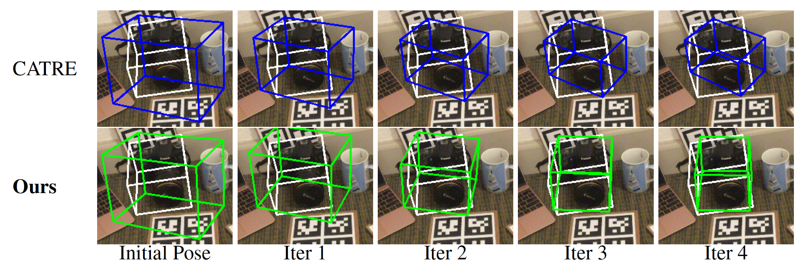

# GeoReF (CVPR 2024) 

Pytorch implementation of GeoReF: Geometric Alignment Across Shape Variation for Category-level Object Pose Refinement<br>
[[Paper](https://arxiv.org/abs/2404.11139), [Project](https://lynne-zheng-linfang.github.io/georef.github.io/)]

## Overview

<!-- 
<p align="center">
    Illstraction of the object pose refinement procedure.
</p> -->


<p align="center">
    The overall framework.
</p>

## Required environment
- Ubuntu 18.04
- Python 3.8 
- Pytorch 1.10.1
- CUDA 11.2
- 1 * RTX 3090

## Virtual environment
```shell
cd GeoReF 
virtualenv GeoReF-env -p /usr/bin/python3.8
```
Then, copy past the following lines to the end of `./GeoReF-env/bin/activate` file:
```shell
CUDAVER=cuda-11.2
export PATH=/usr/local/$CUDAVER/bin:$PATH
export LD_LIBRARY_PATH=/usr/local/$CUDAVER/lib:$LD_LIBRARY_PATH
export LD_LIBRARY_PATH=/usr/local/$CUDAVER/lib64:$LD_LIBRARY_PATH
export CUDA_PATH=/usr/local/$CUDAVER
export CUDA_ROOT=/usr/local/$CUDAVER
export CUDA_HOME=/usr/local/$CUDAVER
```
Then, use `source` to activate the virtualenv:
```shell
source GeoReF-env/bin/activate
```


## Installing
- Install [CUDA-11.2](https://developer.nvidia.com/cuda-11.2.0-download-archive?target_os=Linux&target_arch=x86_64&target_distro=Ubuntu&target_version=2004&target_type=deblocal) 

- Install basic packages:
```shell
chmod +x env_setup.sh
./env_setup.sh
```

## Datasets
## Data Preparation
Please follow the instruction of [object-deformnet](https://github.com/mentian/object-deformnet/tree/master) to prepare the dataset. After the preparation, make sure your datasets folder looks like following: 
```bash
datasets/
├── NOCS
    ├── CAMERA
        ├── train # download from http://download.cs.stanford.edu/orion/nocs/camera_train.zip
        └── val # download from http://download.cs.stanford.edu/orion/nocs/camera_val25K.zip
    ├── REAL
        ├── real_train # download from http://download.cs.stanford.edu/orion/nocs/real_train.zip
        └── real_test # download from http://download.cs.stanford.edu/orion/nocs/real_test.zip
    ├── gts # download from http://download.cs.stanford.edu/orion/nocs/gts.zip
        ├── val 
        └── real_test 
    ├── test_init_poses # we provide
    └── obj_models # download from http://download.cs.stanford.edu/orion/nocs/obj_models.zip
```

Then do the following code:
```bash
cd ROOT/datasets/REAL
mkdir image_set
mv *.txt ./image_set

cd ROOT/datasets/CAMERA
mkdir image_set
mv *.txt ./image_set
```

**Note** Please note that the ground truth pose labels generated by [object-deformnet](https://github.com/mentian/object-deformnet/tree/master) may exhibit slight variations across different runs due to the random sampling procedure during NOCS alignment. These label differences generally do not cause issues and can be ignored. However, if you wish to use the exact same labels as ours, please follow these steps:

1. Download the [NOCS_gts](https://drive.google.com/file/d/1_2Z2hYUZgabKJjrdnonHxS1GCLutNJcc/view?usp=sharing) file.
2. Unzip it and merge the `NOCS_gts/NOCS` folder into the `datasets/NOCS` folder. (Choose `replace` if you have already generated the files.)

The `NOCS_gts` package contains our labeled data along with the intermediate files. After merging, you should see `*_label.pkl` files in the train and test directories and a few files in the `obj_models` folder. For example, the resulting directory structure will look like this:
```bash
datasets/
├── NOCS
    ├── REAL
        └── real_test 
            └── scene_1 
                ├── 0000_color.png 
                ├── 0000_coord.png 
                ├── 0000_depth.png 
                ├── ... 
                └── 0000_label.pkl # merged from the [NOCS_gts](https://drive.google.com/file/d/1_2Z2hYUZgabKJjrdnonHxS1GCLutNJcc/view?usp=sharing)
    └── obj_models 
        ├── ... 
        ├── mug_handle.pkl 
        └── mug_meta.pkl # merged from the [NOCS_gts](https://drive.google.com/file/d/1_2Z2hYUZgabKJjrdnonHxS1GCLutNJcc/view?usp=sharing)
```

## Training

```
./core/catre/train_catre.sh configs/catre/NOCS_REAL/real275.py <gpu_ids> <--seed>(other args)
```

## Testing
```
./core/georef/test_georef.sh configs/georef/NOCS_REAL/real275.py <gpu_ids> <ckpt_path> <--seed>(other args)
```

## Reproduce the results
The trained model can be found at `output/NOCS_REAL/trained/real275_model.pth`. To reproduce the results reported in the paper, execute the following command:

```bash
./core/georef/test_georef.sh configs/georef/NOCS_REAL/real275.py 0 ./output/NOCS_REAL/trained/real275_model.pth --seed 1710996986
```

**Note:** Due to the nature of the inference process, which involves a random point sampling procedure, there may be slight variations between the results obtained using this code and the results reported in the paper. Unfortunately, the random seed used during the experiments conducted for the paper was not recorded. However, by specifying the provided random seed (`1710996986`), you can expect to obtain results that are similar to those reported in the paper. Please be aware that while the overall trends and performance metrics should align closely, some individual metrics may differ slightly.

**Experiment Log** For further validation of the reproduced results, an experiment log is provided (`./output/NOCS_REAL/trained/CVPR_experiment_log/log_20231113_001013.txt.txt`) in the checkpoint directory. This log contains detailed performance scores matching those reported in the paper. Users can refer to this log to verify the accuracy of the reproduced results.


## NOTE
Comments from [CATRE](https://github.com/THU-DA-6D-Pose-Group/CATRE):
>**NOTE** that there is a small bug in the original evaluation [code](https://github.com/hughw19/NOCS_CVPR2019/blob/78a31c2026a954add1a2711286ff45ce1603b8ab/utils.py#L252) of NOCS w.r.t. IOU. We fixed this bug in our evaluation code and re-evaluated all the compared methods in the paper (we only revised the value of IOU and kept rotation/translation results the same, but indeed the accuracy of R/t will also change a little bit). See the revised [code](https://github.com/THU-DA-6D-Pose-Group/CATRE/blob/b649cbad6ed2121b22a37f7fe16ad923688d4995/core/catre/engine/test_utils.py#L158) for details. Also thanks [Peng et al.](https://github.com/swords123/SSC-6D/blob/bb0dcd5e5b789ea2a80c6c3fa16ccc2bf0a445d1/eval/utils.py#L114) for further confirming this bug.


## Citation
If you find this repo useful in your research, please consider citing:
```
@InProceedings{Zheng_GeoReF_2024_CVPR,
    author    = {Zheng, Linfang and Tse, Tze Ho Elden and Wang, Chen and Sun, Yinghan and Dasgupta, Esha and Chen, Hua and Leonardis, Ale\v{s} and Zhang, Wei and Chang, Hyung Jin},
    title     = {GeoReF: Geometric Alignment Across Shape Variation for Category-level Object Pose Refinement},
    booktitle = {Proceedings of the IEEE/CVF Conference on Computer Vision and Pattern Recognition (CVPR)},
    month     = {June},
    year      = {2024},
}
```

## Acknowledgment
Our implementation leverages the code from [3dgcn](https://github.com/j1a0m0e4sNTU/3dgcn), [object-deformnet](https://github.com/mentian/object-deformnet), [CATRE](https://github.com/THU-DA-6D-Pose-Group/CATRE), [HS-Pose](https://github.com/Lynne-Zheng-Linfang/HS-Pose), [pointnet](https://github.com/fxia22/pointnet.pytorch/tree/master).